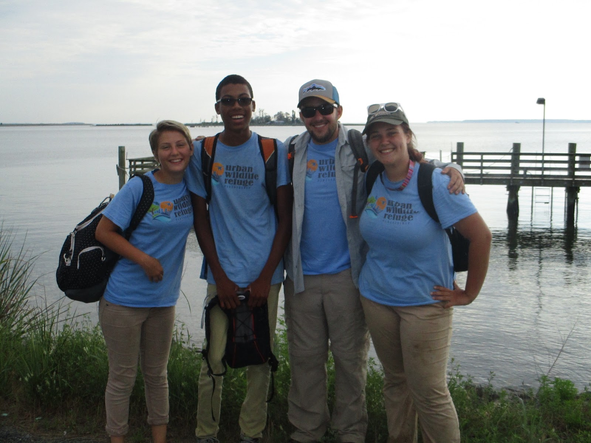

### ***About Me:***

---

# 🌎 **My GIS Portfolio** 🌍
#### Navigate my porfolio by clicking title headings to be directed to a project page
---
# 🌐 Advanced GIS Coursework 🌐

##### Click the links below to be directed to my GIS coursework projects. 

#### [1️⃣ Project 1: A Spatial Analysis of Florida Sea Level Rise ](/project1_486/index.md)

#### [2️⃣ Project 2: Deep Diving Spatial Autocorrelation to Identify Nutrient Pollution Hotspots in the Chesapeake Bay Watershed ](/project2_486/index.md)

#### [3️⃣ Project 3: Nutrient Hotspots Continued, Webmaps with Quantitative Data! ](FinalProject_486/index.md)

#### [4️⃣ Lab Outputs ](/labs/index.md) 

---
# 🌲 USDA Forest Service Research 🌳

#### [🗺️ Baltimore Stewardship Mapping Project 🗺️](project_STEWMAP/index.md)

##### As a research assistant for the USDA Forest Service I am updating Baltimore’s comprehensive map of the hundreds of civic groups partcipiating in environmental stewardship in Baltimore as part of the 2019 Baltimore STEWMAP Project. The project is currently ongoing, click the STEWMAP project link above to see some highlights. More information about Baltimore's stewardship mapping project and old stewardship maps and analyses can be found at the Forest Service's webpage, click the link below to be redirected to the site!

##### [Click to be redirected to the US Forest Service STEWMAP Webpage](https://www.nrs.fs.fed.us/stew-map/baltimore/)

---
# [🦈 National Aquarium Internship 🐟](https://rad-sc.github.io/NationalAquarium/UCEEI_presentation.pdf)
##### During the summer of 2016 I was an intern for the National Aquarium through their Urban Wildlife Refuge Partnership with The USFW, NOAA, The EPA, and others. Click the title above to access my final internship presentation. The photo below features myself and the other interns from left to right: Sarah, Sheldon, AJ, Logan. 

---
# 🌊 Personal Projects 🏝️
---
#### [📷 Wildlife Photography 📷](https://rad-sc.github.io/Webmap/qgis2web_photomap/index.html)
##### I love to travel and take pictures of wildlife and landscapes. Below are a few of my favorite photos that I've taken. Click the title link above to see a detailed webmap of my photos! If you want to stay updated on my most recent pictures Instagram is the best place to look, follow me @AllThingsWild.Photos or click the link below to be directed to my page.
##### [Instagram.com/AllThingsWild.Photos](https://www.instagram.com/allthingswild.photos/)

---
# 🎓 Other Academic Works 🔬
---
#### 🥒 Algal Biofuels Research 🥒
##### As a student researcher for the UMBC Biology Department I am working on an individual research project in Dr. Stephen Miller's algal biofuels lab. My project focuses on using molecular biology techniques and recombiant DNA technology to genetically modify existing algal organisms and improve their capability to produce biofuels. This project is still in progress, up to date information and methods can be read on my project poster, which can be accessed by clicking the title link above.
  

---

Page template forked from <a href="https://github.com/evanca/quick-portfolio">evanca</a>

<!-- Remove above link if you don't want to attibute -->
